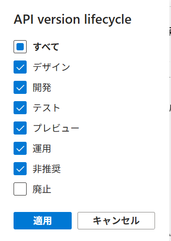

# API Center

このプロジェクトは、API Center(APIC) の機能をハンズオン形式で学習できるリポジトリです。

## APIC 構成

下図は本ハンズオン環境の構成です。<br>
Azure API Center (APIC) を中心に、API Management(APIM)、パートナー MCP (GitHub / MSdocs / Atlassian)API 定義、Key Vault、GitHub Actions（カスタム API 定義の バージョン自動登録／ライフサイクル遷移）などの連携要素を包含しています。


## ハンズオン概要

本ハンズオンでは以下の一連の流れを通じて Azure API Center の主要機能を体験します。

1. **パートナー MCP の確認**  
   Azure ポータルや VS Code 拡張機能 ("Open in Visual Studio Code") を活用し、登録済みパートナー MCP（GitHub / MSdocs / Atlassian）の API、バージョン、定義、デプロイメント階層を把握します。

2. **カスタム API のライフサイクル管理**  
   GitHub Actions を利用し、OpenAPI 定義ファイルのコミット／マージのみで `preview → production → deprecated → retired` の段階的なライフサイクル遷移を体験します。

3. **その他の機能**
   - **APIM API キー認証**  
     APIC ポータルの "Try this API" から `Ocp-Apim-Subscription-Key` を確認します。
   - **API 分析（Analysis）**  
     API 分析画面で定義の品質や改善点を可視化し、ガバナンスや品質管理の観点を確認します。
   - **VS Code 拡張での 2 つのビュー**  
     管理プレーン（AZURE API CENTER）と開発者向けポータルビュー（API CENTER PORTAL VIEW）の権限や利用目的の違いを確認します。

より詳細な手順は [ハンズオン詳細](./ハンズオン.md) を参照してください。

## 環境セットアップ手順

### 前提条件

事前に、[https://github.com/ap-communications/apic-mcp-ai](https://github.com/ap-communications/apic-mcp-ai) をご自身の APC の GitHub アカウントにフォークしてください。

### APIM と Function MCP のデプロイ

1. [APIM-aoai-bingsearchmcp](https://github.com/apc-n-orita/APIM-aoai-bingsearchmcp) の「デプロイ実行」までの手順を進めてください。

### API Center のデプロイ

1. 必要な環境変数を `main.tfvars.json` に記載します。

   > location は API Center 対応リージョンのみ指定可能:<br>
   > "australiaeast", "canadacentral", "centralindia", "eastus", "francecentral", "swedencentral", "uksouth", "westeurope"

   例:

   ```json
   {
     "location": "${AZURE_LOCATION}",
     "environment_name": "${AZURE_ENV_NAME}",
     "subscription_id": "${AZURE_SUBSCRIPTION_ID}",
     "apim_name": "<APIM名>",
     "apim_rg_name": "<APIMのリソースグループ>",
     "github_repo": "<forkしたgitリポジトリ名>",
     "github_owner": "<GitHubオーナー名>"
   }
   ```

1. 以下のコマンドで環境をセットアップします。
   > Terraform の処理中に `azurecli` を直接実行する箇所があります。`az account show` で表示されるサブスクリプション ID が、`azd up` で指定したものと一致していることを確認してください。
   ```bash
   azd up
   ```

### 手動設定項目

#### API Center ポータルの設定

1. [API センター ポータルの構成と発行](https://learn.microsoft.com/ja-jp/azure/api-center/set-up-api-center-portal#configure-and-publish-the-api-center-portal)の手順に従い、クライアント ID には [API Center のデプロイ](#api-center-のデプロイ)で出力された `apic_entra_app_id` を入力してください。
2. ポータル設定の「可視性」では、「API version lifecycle」の廃止以外を選択し、適用します。
   
3. 「保存と公開」をクリックして設定を反映します。

#### APIC への APIM API キーの登録

1. [API センターに API キー構成を追加する](https://learn.microsoft.com/ja-jp/azure/api-center/authorize-api-access#2--add-api-key-configuration-in-your-api-center)の手順を実施してください。その際 API キー パラメーター名は `Ocp-Apim-Subscription-Key` を指定し、API キー Key Vault シークレットは [API Center のデプロイ](#api-center-のデプロイ)のリソースグループ配下の Key Vault を指定してください。
2. [API バージョンに認証構成を追加する](https://learn.microsoft.com/ja-jp/azure/api-center/authorize-api-access#add-authentication-configuration-to-an-api-version)の手順に従い、手順 1 で作成した API キー構成を `api-key-publish` の API バージョンに追加してください。
3. [特定のユーザーまたはグループによるアクセスを管理する](https://learn.microsoft.com/ja-jp/azure/api-center/authorize-api-access#manage-access-by-specific-users-or-groups)の手順に従い、アクセスポリシーに自身を追加してください。

#### Github actions 変数とシークレット設定

1. fork したリポジトリの「設定」→「Secrets and variables」→「Actions」から、以下の変数とシークレットを追加してください。

##### シークレット

- `AZURE_CLIENT_ID` : マネージド ID（github-actions）のクライアント ID
- `AZURE_SUBSCRIPTION_ID` : マネージド ID（github-actions）のサブスクリプション ID
- `AZURE_TENANT_ID` : マネージド ID（github-actions）のテナント ID

##### 変数

- `RESOURCE_GROUP` : APIC のリソースグループ名
- `SERVICE_NAME` : APIC 名

> 参考: [GitHub Actions でシークレットと変数を設定する方法](https://docs.github.com/ja/actions/security-guides/encrypted-secrets)

## ハンズオン

[ハンズオン](./ハンズオン.md)

## 環境削除

環境を削除する際は、以下の手順に従ってください。

1. APIC の削除  
   次のコマンドを実行して、APIC 環境を削除します。

   ```bash
   azd down
   ```

2. APIM-aoai-bingsearchmcp の削除  
   [APIM-aoai-bingsearchmcp](https://github.com/apc-n-orita/APIM-aoai-bingsearchmcp) の環境も同様に、以下のコマンドで削除します。
   ```bash
   azd down
   ```
