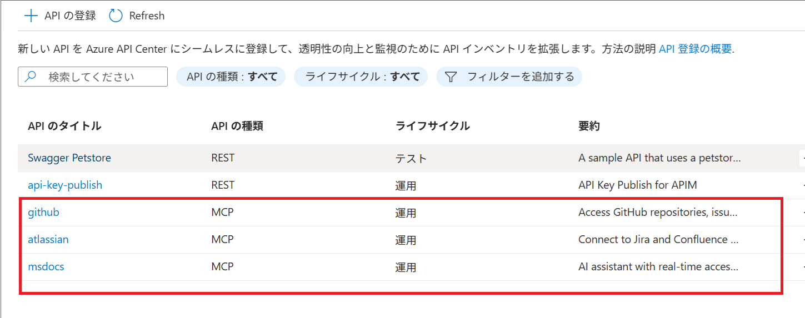
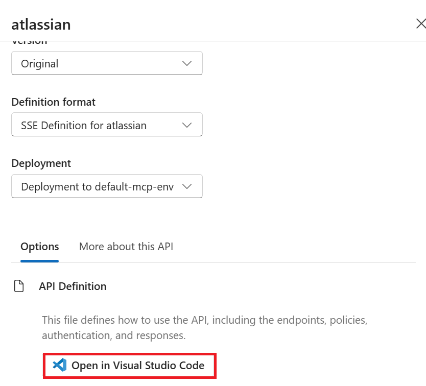
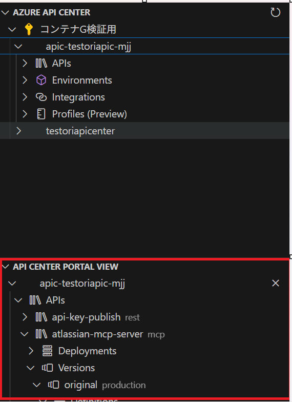
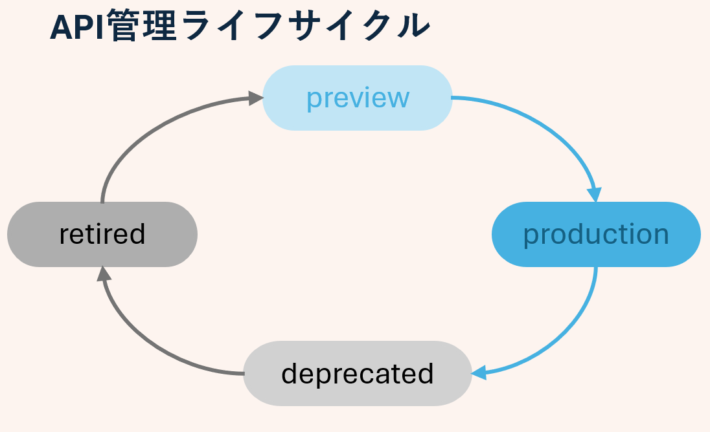
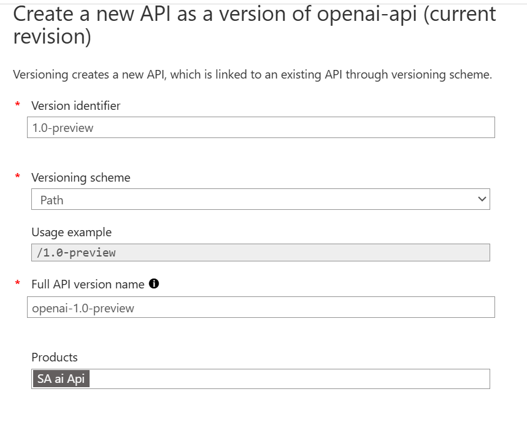
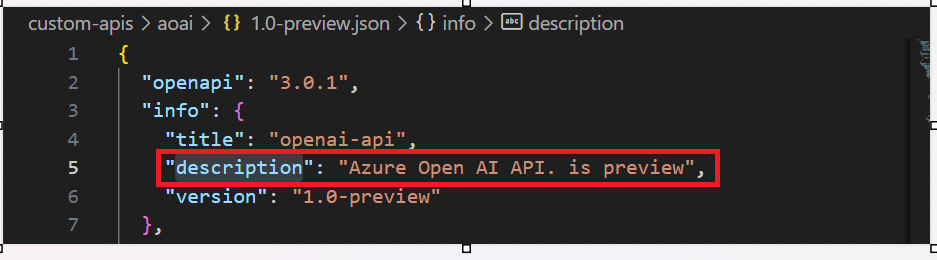
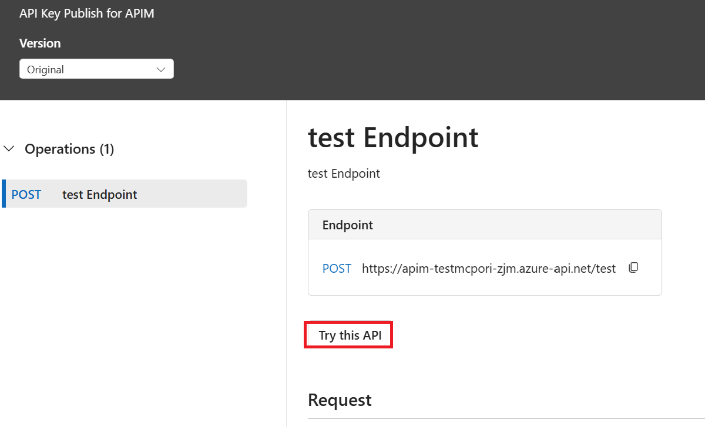
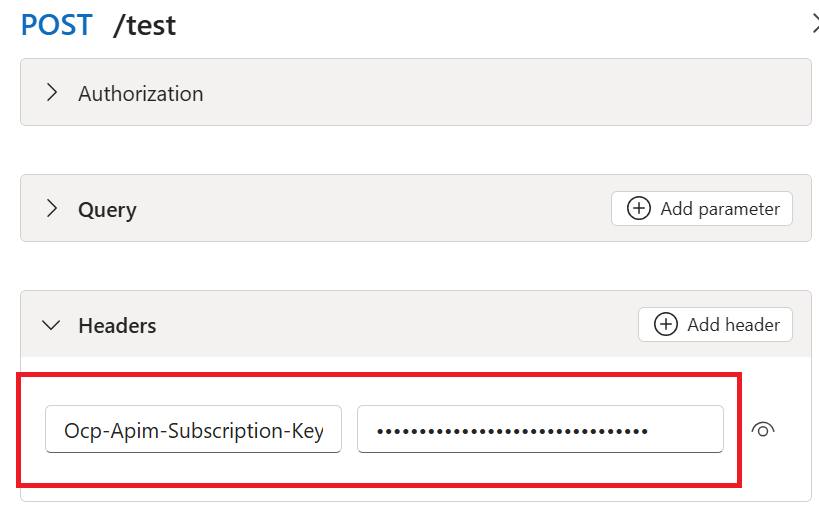
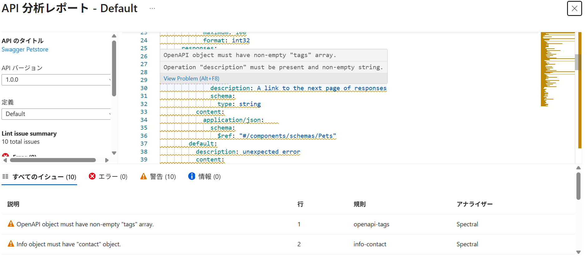
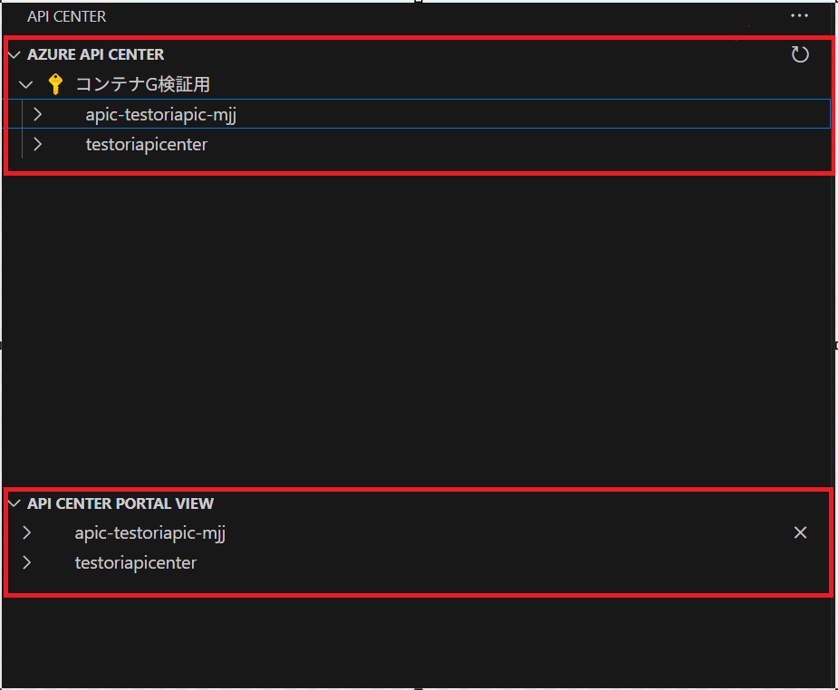

# APIC ハンズオン

## パートナー MCP の確認

API Center (APIC) に登録されているパートナー MCP を確認します。

### Azure ポータルでの確認

1. Azure ポータルで APIC のリソースにアクセスし、「資産」→「API」を選択します。
2. 下記画像の赤枠部分で、パートナー MCP が登録されていることを確認できます。
   
   このハンズオンでは、パートナー MCP として Github、MSdocs、Atlassian を登録しています。

### Visual Studio Code での確認

1. APIC ポータル (https://<APIC 名>.portal.<APIC のリージョン>.azure-apicenter.ms/) にログインします。
2. 任意の API を選択し、「Open in Visual Studio Code」をクリックします（APIC の拡張機能が VS Code にインストールされます）。
   
   拡張機能がインストールされると、APIC ポータルが VS Code 上に表示されます。
   

#### API 構成例

各パートナー MCP の API 構成は以下のようになっています。

```ini
# API構成
- Deployments # リモート MCP の URL
   - default-deployment # 右クリックで MCP URL をコピー可能
- Versions # API バージョン
   - original # オリジナルバージョン
      - Definitions # API 定義。各定義を OpenAPI ドキュメントや Markdown に出力可能
         - default-sse # SSE の API 定義
         - default-streamable # streamable の API 定義
```

## カスタム API のライフサイクル (GitHub Actions)

このセクションでは、カスタム API を GitHub Actions を使って登録し、  
「preview」→「production」→「deprecated」→「retired」というライフサイクルの流れを体験します。



### 前提条件

事前に[フォークした apic-mcp-ai リポジトリ](./README.md#前提条件)をローカルにクローンしていること

### preview

1. GitHub 上でフォークした apic-mcp-ai リポジトリの `main` ブランチから `feat/api-preview` ブランチを作成します。
2. [APIM と Function MCP のデプロイ](./README.md#apim-と-function-mcp-のデプロイ)の手順で作成した APIM リソースにアクセスし、「API」→「openai-api」を選択します。
3. 「openai-api」を右クリックして「add version」を選択し、以下の内容を入力して「create」をクリックします。
   - Version identifier : `1.0-preview`
   - Full API version name : `openai-1-0-preview`
   - Products: `SA ai Api` を選択
     
4. 追加した `1.0-preview` バージョンの API を OpenAPI 3.0 (JSON) 形式でエクスポートし、クローンしたリポジトリの `custom-apis/aoai` ディレクトリに配置します。
5. ファイル名を「1.0-preview.json」に変更します。
6. ファイルを開き、`info.description` 値の語尾に「. is preview」を追記して保存します。
   
7. 変更内容をコミットし、1 で作成したブランチに push します。
8. GitHub 上でフォークした apic-mcp-ai リポジトリの `main` ブランチへ Pull Request を作成します。
9. 作成した Pull Request をマージします。（マージ後、GitHub Actions が実行され、API Center に preview の API が登録されます）
10. VS Code の APIC ポータルで preview の openai-api が登録されていることを確認します。

### deprecated

1. GitHub 上でフォークした apic-mcp-ai リポジトリの `main` ブランチから `feat/api-depre-produ` ブランチを作成します。
2. [APIM と Function MCP のデプロイ](./README.md#apim-と-function-mcp-のデプロイ)の手順で作成した APIM リソースにアクセスし、「API」→「openai-api」を選択します。
3. 「openai-api」を右クリックして「add version」を選択し、以下の内容を入力して「create」をクリックします。
   - Version identifier : `2.0`
   - Full API version name : `openai-2-0`
   - Products: `SA ai Api` を選択
4. 追加した `2.0` バージョンの API を OpenAPI 3.0 (JSON) 形式でエクスポートし、クローンしたリポジトリの `custom-apis/aoai` ディレクトリに配置します。
5. エクスポートしたファイル名を「2.0.json」に変更します。
6. 既存の「1.0-preview.json」ファイルを開き、`info.description` の語尾に「. will be retired on 20xx/xx/xx」を追記して保存します。
7. 変更内容をコミットし、作成したブランチに push します。
8. GitHub 上でフォークした apic-mcp-ai リポジトリの `main` ブランチへ Pull Request を作成します。
9. Pull Request をマージします。マージ後、GitHub Actions が実行され、API Center に production の openai-api (バージョン 2.0) が登録され、1.0-preview の openai-api が deprecated となっていることを VS Code の APIC ポータルで確認します。

### retired

1. GitHub 上でフォークした apic-mcp-ai リポジトリの `main` ブランチから `feat/api-retired` ブランチを作成します。
2. 「1.0-preview.json」ファイルを開き、`info.description` の語尾に「. is retired」と追記して保存します。
3. 変更内容をコミットし、作成したブランチに push します。
4. GitHub 上で `main` ブランチへ Pull Request を作成し、マージします。
5. マージ後、GitHub Actions が実行され、VS Code の APIC ポータルで 1.0-preview の openai-api が表示されないことを確認します。
   > [API Center ポータルの設定](./README.md#api-center-ポータルの設定)により、retired の API は APIC ポータルに表示されないよう可視性が設定されています。

## その他

### APIM API キー認証

[APIM API キーの登録](./README.md#apic-への-apim-サブスクリプションキーの登録)の手順で、APIM API キー認証を設定しています。サブスクリプションキーごとに表示可能な Entra ID グループやユーザーをアクセスポリシーで制限できます。

- サブスクリプションキーの取得

1. APIC ポータル (https://<APIC 名>.portal.<APIC のリージョン>.azure-apicenter.ms/) にログインします。
2. `api-key-publish` を選択し、「View documentation」→「Try this API」をクリックします。
   
3. レスポンスヘッダーの `Ocp-Apim-Subscription-Key` に、発行された APIM API キーが表示されます。
   

### API 分析

Azure ポータルの APIC リソース →「API 分析」から、組み込みまたはカスタムの分析プロファイルを利用して API の分析が可能です。

分析レポートでは、エラー箇所や改善点を視覚的に確認できます。



### VS Code の APIC 拡張機能で表示される「AZURE API CENTER」と「API CENTER PORTAL VIEW」の違い

VS Code の APIC 拡張機能では、

- **AZURE API CENTER** は管理者向けの管理プレーンで、API の登録や設定などを行う画面です。
- **API CENTER PORTAL VIEW** は開発者向けのデータプレーンで、登録済み API の利用やテストが可能な画面です。  
  それぞれの役割に応じて、必要な Azure ロール権限が異なります。

- **AZURE API CENTER**  
   APIC の管理プレーンであり、管理者が API の登録や設定などの作業を行う画面（画像の上部赤枠）。  
   利用には「Azure API Center Service Contributor」ロールが必要（共同作成者ロールにもこの権限は含まれている）。

- **API CENTER PORTAL VIEW**  
   APIC のデータプレーンで、開発者などが登録済み API を利用するための画面（画像の下部赤枠）。  
   利用には「Azure API Center Data Reader」ロールが必要



これでハンズオンは完了です。<br>
続いて、[環境削除](./README.md#環境削除)の手順をご確認ください。
